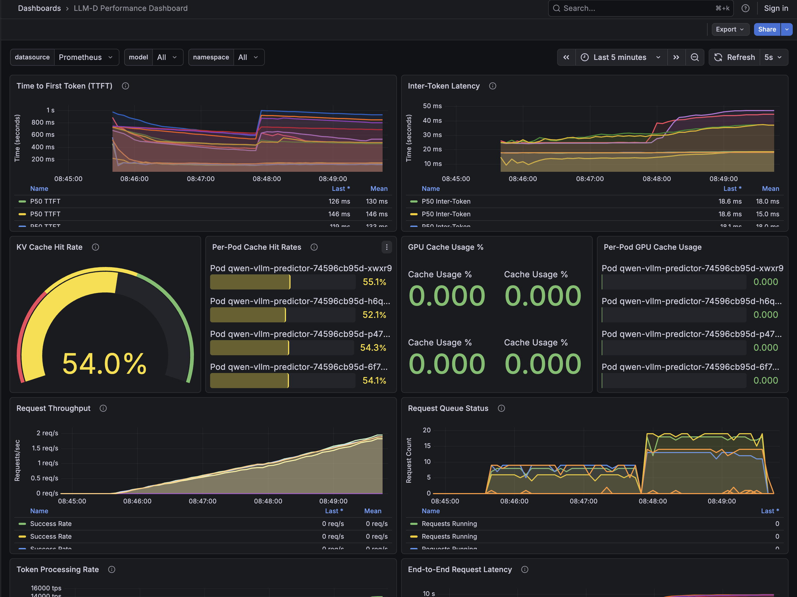
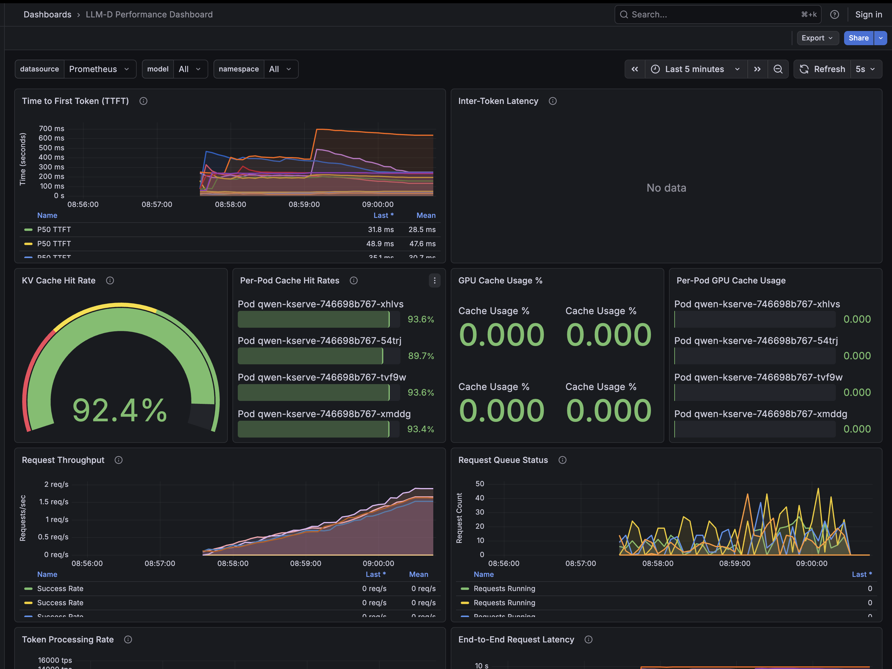

# Benchmarking LLM-D Intelligent Inference Scheduling

This guide walks through an A/B comparison benchmark between vanilla vLLM (round-robin routing) and LLM-D (intelligent inference scheduling) using the same model and number of replicas.

This guide is configured to deploy `Qwen/Qwen3-0.6B` using 4 x NVIDIA L40s GPUs but it can easily be customized to use other gpus and models.

The key things to understand when benchmarking intelligent inference scheduling with llm-d versus vanilla vLLM are:
* Multiple replicas of vLLM / llm-d are required, in this example we use 4 replicas which would be the recommended minimum to demonstrate intelligent inference scheduling.  **Do not run benchmarks with a single replica**
* KV Cache is key.  When an LLM processes context (specifically a large prompt), it take a lot of compute power to generate the key / value tensors for every token across every attention layer.
* There is a significant performance boost gained by retrieving these tensors from the KV Cache rather than re-computing.
* In a distributed environment i.e. multiple instances of vLLM, each instance has its own KV Cache, so it's very beneficial to route large context to the vLLM instance which has already cached these tensors.
* To highlight the value of prefix-aware routing in the intelligent inference scheduler, it is critical to benchmark with a dataset with repeated context. For example, a dataset which simulates multi-turn chat conversations where the previous context is included with each turn.  **Do not run benchmarks with short unique prompts**, as they will not benefit from intelligent inference scheduling.

So for an effective comparison of intelligent inference scheduling with llm-d versus vanilla vLLM, we need to generate test data with large repeated prompts.  We should understand how much KV Cache is available per instance and generate our test data accordingly, e.g. to fill the KV Cache on each instance to 80%.

In the example detailed here, we first find out how many tokens we can store in the KV Cache once the model is served, and then use a tool to generate benchmarking prompts to use 80% of each replica.  

## Prerequisites

- OpenShift cluster with GPU nodes available (4 GPUs)
- `oc` CLI authenticated to the cluster
- Red Hat OpenShift AI operator installed

## Step 1: Deploy Monitoring Stack

Deploy Prometheus and Grafana for real-time metrics visualization during benchmarks.

```bash
# From the 08-benchmarking directory
cd 08-benchmarking/intelligent-inference-scheduler

# Deploy monitoring
oc apply -k monitoring

# Wait for Grafana to be ready
oc wait --for=condition=ready pod -l app=grafana -n llm-d-monitoring --timeout=300s

# Get Grafana URL
export GRAFANA_URL=$(oc get route grafana-secure -n llm-d-monitoring -o jsonpath='{.spec.host}')
echo "Grafana: https://$GRAFANA_URL"
```

Access Grafana with default credentials: `admin` / `admin`

### Key Metrics to Watch

| Metric | What to Look For |
|--------|------------------|
| **KV Cache Hit Rate** | Higher is better - LLM-D should show 90%+ vs ~60% for round-robin, depending on dataset|
| **Time to First Token (TTFT)** | Lower Mean TTFTand P95/P99 indicates better tail latency |
| **Requests per Second** | Overall throughput |
| **GPU Utilization** | Balanced utilization across replicas |

## Step 2: Generate Test Data

Generate prompts sized to fill approximately 80% of the KV cache on each GPU. This ensures the benchmark exercises LLM-D's prefix-aware routing under realistic memory pressure, where intelligent scheduling makes the biggest difference.

### Sizing Prompts for Your GPU

The key inputs are:

1. **Available KV cache per GPU** - Total VRAM minus model weights. We can find this information in the vLLM logs during startup.
2. **Number of replicas** - How many serving pods are deployed.
3. **Prompt size in tokens** - How large each request's context is.

The generator targets 80% KV cache utilization and calculates how many unique prompts are needed per replica, then generates that many across all replicas.

**Example: Qwen3-0.6B on 4 x NVIDIA L40S GPUs**

Once the model is loaded by vLLM, the logs will look similar to this:

```
(EngineCore_DP0 pid=40) INFO 03-03 16:30:21 [gpu_worker.py:359] Available KV cache memory: 37.42 GiB
(EngineCore_DP0 pid=40) INFO 03-03 16:30:22 [kv_cache_utils.py:1229] GPU KV cache size: 350,304 tokens
(EngineCore_DP0 pid=40) INFO 03-03 16:30:22 [kv_cache_utils.py:1234] Maximum concurrency for 16,000 tokens per request: 21.89x
```

This tells us we have KV Cache capacity for 350,304 tokens per GPU, which would hold 21 x 16,000 token requests.  For our benchmark we are going to use 8,000 token requessts, so each GPU should be able to hold 42 unique prompts.

### Generate Prompts

We're going to use the provided script `kv-cache-prompt-generator.py` to create a prompt file sized for your hardware. The script accepts:

| Argument | Description |
|----------|-------------|
| `--kv-cache-size` | KV cache capacity per replica, in tokens |
| `--num-replicas` | Number of serving replicas |
| `--prompt-size` | Target size of each prompt, in tokens |
| `--num-pairs` | Number of times each unique prompt is repeated (simulates multi-turn reuse) |
| `--repeat-gap` | Number of other prompts between repetitions of the same prompt (default: 10) |
| `--output` | Output CSV path (default: `prompts.csv`) |

This will:
1. Calculate 80% of 350304 = 280243 tokens per replica
2. Divide by 8,000 tokens/prompt = 35 unique prompts per replica
3. Generate 35 x 4 = 140 unique prompts total
4. Repeat each prompt 8x (with a gap of 10 other prompts between repetitions) to test cache reuse
5. Write a GuideLLM-compatible CSV to `prompts.csv`


**Example: 4 x L40S with Qwen3-0.6B**

```bash
cd test-data-generator/prefix

pip install -r requirements.txt


python kv-cache-prompt-generator.py \
  --kv-cache-size 350304 \
  --num-replicas 4 \
  --prompt-size 8000 \
  --num-pairs 8 \
  --output prompts.csv
```

You will see a response like:

```
KV cache 80%: 280243 tokens/replica  ->  35 unique prompts/replica  x  4 replicas  =  140 unique prompts total
Target prompt length: ~6153 words (~8000 tokens)
Done. Wrote 1120 rows (140 unique x 8 repetitions) to prompts.csv.
```

The repeated prompts are the key to demonstrating LLM-D's advantage: with round-robin routing, a repeated prompt has only a 1-in-4 chance of hitting the replica that cached it. With LLM-D's prefix-cache-scorer, it is routed to the correct replica every time.

### Upload Test Data to the Cluster

Upload the generated test data to a separate `demo-llm-benchmarks` namespace. This keeps benchmark data isolated from model deployments, so tearing down vLLM or LLM-D doesn't delete your test data.

```bash
# Create the benchmark namespace and PVC
oc apply -f - <<'EOF'
apiVersion: v1
kind: Namespace
metadata:
  name: demo-llm-benchmarks
  annotations:
    openshift.io/display-name: Demo - LLM Benchmarks
---
apiVersion: v1
kind: PersistentVolumeClaim
metadata:
  name: benchmark-data
  namespace: demo-llm-benchmarks
spec:
  accessModes:
    - ReadWriteOnce
  resources:
    requests:
      storage: 1Gi
EOF

# Launch a temporary pod to copy data into the PVC
oc apply -f - <<'EOF'
apiVersion: v1
kind: Pod
metadata:
  name: benchmark-data-loader
  namespace: demo-llm-benchmarks
spec:
  restartPolicy: Never
  securityContext:
    fsGroup: 0
  containers:
    - name: loader
      image: registry.access.redhat.com/ubi9/ubi:latest
      command: ["sleep", "3600"]
      volumeMounts:
        - name: data
          mountPath: /data
  volumes:
    - name: data
      persistentVolumeClaim:
        claimName: benchmark-data
EOF

oc wait --for=condition=ready pod/benchmark-data-loader -n demo-llm-benchmarks --timeout=120s


# Return to the 08-benchmarking folder

cd ../..

# Copy the prompts file into the PVC

oc cp ./test-data-generator/prefix/prompts.csv demo-llm-benchmarks/benchmark-data-loader:/data/prompts.csv

# Clean up the loader pod
oc delete pod benchmark-data-loader -n demo-llm-benchmarks
```

## Step 3: Deploy vLLM with 4 Replicas

Deploy vanilla vLLM as the baseline. This uses standard round-robin load balancing across 4 replicas serving `Qwen/Qwen3-0.6B`.

```bash
# Deploy vLLM (creates namespace, ServingRuntime, InferenceService with 4 replicas, Service, PodMonitor)
oc apply -k vllm/qwen

# Wait for all 4 replicas to be ready
oc wait --for=condition=ready pod -l serving.kserve.io/inferenceservice=qwen-vllm \
  -n demo-llm --timeout=600s

# Verify 4 pods are running
oc get pods -n demo-llm -l serving.kserve.io/inferenceservice=qwen-vllm
```

The vLLM deployment includes:
- **ServingRuntime** (`vllm-runtime`) - vLLM container with `--max-model-len=16000`
- **InferenceService** (`qwen-vllm`) - 4 replicas, 1 GPU each
- **Service** (`qwen-vllm-lb`) - ClusterIP load balancer across all replicas
- **PodMonitor** - Exposes vLLM metrics to Prometheus

## Step 4: Run GuideLLM Benchmark Against vLLM

Run GuideLLM as an OpenShift Job targeting the vLLM deployment. The included kustomize overlay pre-configures the target URL.

```bash
# Deploy the GuideLLM benchmark job targeting vLLM
oc apply -k guidellm/overlays/vllm

# Watch the job progress
oc logs -f job/vllm-guidellm-benchmark -n demo-llm-benchmarks

# Wait for completion
oc wait --for=condition=complete job/vllm-guidellm-benchmark -n demo-llm-benchmarks --timeout=600s
```

The vLLM overlay targets `http://qwen-vllm-lb.demo-llm.svc.cluster.local:8000/v1` and runs benchmarks at concurrency levels 8, and 16 using the generated prompts.

### Retrieve vLLM Results

Once the job completes you will see the request latency statistics e.g.

```
ℹ Request Latency Statistics (Completed Requests)
|============|=========|========|=======|=======|======|======|======|======|
| Benchmark  | Request Latency || TTFT         || ITL        || TPOT       ||
| Strategy   | Sec             || ms           || ms         || ms         ||
|            | Mdn     | p95    | Mdn   | p95   | Mdn  | p95  | Mdn  | p95  |
|------------|---------|--------|-------|-------|------|------|------|------|
| concurrent | 3.8     | 4.5    | 184.1 | 500.7 | 14.5 | 17.0 | 15.3 | 18.2 |
| concurrent | 6.1     | 7.5    | 241.0 | 872.2 | 23.1 | 28.2 | 24.4 | 29.9 |
|============|=========|========|=======|=======|======|======|======|======|
```

Take note of these results for vLLM.

#### Grafana dashboard

Look at the grafana dashboard, you should see the KV Cache Hit rate landing at around 54%, meaning just over half of the requests are hitting vLLM pods which have already processed this prompt.  You should also see some high values being recorded for TTFT throughout the benchmark.



## Step 5: Replace vLLM with LLM-D

Tear down the vLLM deployment and deploy LLM-D with the same model and 4 replicas. LLM-D adds an intelligent scheduler that routes requests based on prefix cache scoring, KV-cache utilization, and queue depth.

```bash
# Remove vLLM deployment
oc delete -k vllm/qwen

# Reset Prometheus to get clean metrics for the LLM-D run
oc delete pod -l app=prometheus -n llm-d-monitoring
oc wait --for=condition=ready pod -l app=prometheus -n llm-d-monitoring --timeout=120s

# Deploy LLM-D (creates Gateway, HardwareProfile, LLMInferenceService with 4 replicas)
oc apply -k llm-d/qwen

# Wait for all 4 replicas to be ready
oc wait --for=condition=ready pod -l app.kubernetes.io/name=qwen \
  -n demo-llm --timeout=600s

# Verify 4 pods are running
oc get pods -n demo-llm -l app.kubernetes.io/name=qwen
```

The LLM-D deployment includes:
- **GatewayClass + Gateway** - Ingress via OpenShift Gateway API
- **HardwareProfile** - GPU resource profile for the model pods
- **LLMInferenceService** (`qwen`) - 4 replicas with intelligent scheduling configured:
  - `prefix-cache-scorer` (weight: 3) - Routes to replicas that already have the prefix cached
  - `kv-cache-utilization-scorer` (weight: 2) - Balances GPU memory usage
  - `queue-scorer` (weight: 2) - Avoids overloaded replicas

## Step 6: Run GuideLLM Benchmark Against LLM-D

Run GuideLLM as an OpenShift Job targeting the LLM-D deployment. The overlay pre-configures the target URL to route through the LLM-D intelligent scheduler.

```bash
# Deploy the GuideLLM benchmark job targeting LLM-D
oc apply -k guidellm/overlays/llm-d

# Watch the job progress
oc logs -f job/llm-d-guidellm-benchmark -n demo-llm-benchmarks

# Wait for completion
oc wait --for=condition=complete job/llm-d-guidellm-benchmark -n demo-llm-benchmarks --timeout=600s
```

The LLM-D overlay targets `http://openshift-ai-inference-openshift-default.openshift-ingress.svc.cluster.local/demo-llm/qwen/v1`, which routes through the intelligent scheduler.

### Retrieve LLM-D Results

Once the job completes you will see the request latency statistics e.g.

```
ℹ Request Latency Statistics (Completed Requests)
|============|=========|========|======|=======|======|======|======|======|
| Benchmark  | Request Latency || TTFT        || ITL        || TPOT       ||
| Strategy   | Sec             || ms          || ms         || ms         ||
|            | Mdn     | p95    | Mdn  | p95   | Mdn  | p95  | Mdn  | p95  |
|------------|---------|--------|------|-------|------|------|------|------|
| concurrent | 3.5     | 5.9    | 77.1 | 332.2 | 13.4 | 22.5 | 13.9 | 23.5 |
| concurrent | 4.7     | 6.9    | 87.4 | 490.4 | 18.7 | 26.0 | 19.0 | 27.4 |
|============|=========|========|======|=======|======|======|======|======|
```

Take note of these results for LLM-D.

#### Grafana dashboard

Look at the grafana dashboard, you should see the KV Cache Hit rate landing at around 92%, meaning the majority of requests are hitting vLLM pods which have already processed this prompt.  You should also see the TTFT values steadily declining.  Both of these metrics are indications of the benefits of llm-d intelligent inference scheduling.




## Step 7: Compare Results

Compare the GuideLLM output from Steps 4 and 6 side-by-side. The benchmarks were run at concurrency levels of 32 and 64.

### Request Latency

| | vLLM | | LLM-D | | |
|--|------|------|-------|------|------|
| **Concurrency** | **Mdn (s)** | **p95 (s)** | **Mdn (s)** | **p95 (s)** | **Improvement (Mdn)** |
| 32 | 3.8 | 4.5 | 3.5 | 5.9 | **8% faster** |
| 64 | 6.1 | 7.5 | 4.7 | 6.9 | **23% faster** |

### Time to First Token (TTFT)

| | vLLM | | LLM-D | | |
|--|------|------|-------|------|------|
| **Concurrency** | **Mdn (ms)** | **p95 (ms)** | **Mdn (ms)** | **p95 (ms)** | **Improvement** |
| 32 | 184.1 | 500.7 | 77.1 | 332.2 | **58% faster** (Mdn), **34% faster** (p95) |
| 64 | 241.0 | 872.2 | 87.4 | 490.4 | **64% faster** (Mdn), **44% faster** (p95) |

TTFT is where LLM-D's intelligent routing shows the biggest impact. At concurrency 64, median TTFT drops from 241 ms to 87 ms because LLM-D routes requests to replicas that already have the prefix cached, avoiding redundant prefill computation. The improvement is even more pronounced at the p95 tail: 872 ms down to 490 ms.

### Inter-Token Latency (ITL) and Time Per Output Token (TPOT)

| | vLLM | | LLM-D | | |
|--|------|------|-------|------|------|
| **Concurrency** | **ITL Mdn (ms)** | **TPOT Mdn (ms)** | **ITL Mdn (ms)** | **TPOT Mdn (ms)** | **Improvement** |
| 32 | 14.5 | 15.3 | 13.4 | 13.9 | ~8% faster (ITL), ~9% faster (TPOT) |
| 64 | 23.1 | 24.4 | 18.7 | 19.0 | **19% faster** (ITL), **22% faster** (TPOT) |

At higher concurrency, LLM-D's more efficient cache utilization reduces decode-phase latency as well. The improvement scales with load because cache hits free up GPU compute that would otherwise be spent on redundant prefill.

### KV Cache Hit Rate (Grafana)

| Metric | vLLM | LLM-D |
|--------|------|-------|
| KV Cache Hit Rate | ~65% | ~94% |

With round-robin routing, a repeated prompt has only a 1-in-4 chance of hitting the replica that cached it. LLM-D's prefix-cache-scorer routes to the correct replica, pushing cache hit rates from ~65% to ~94%.

### Why LLM-D Performs Better

The results demonstrate two key advantages of intelligent inference scheduling:

1. **Dramatically lower TTFT** - By routing requests to replicas that already hold the prefix in KV cache, LLM-D avoids redundant prefill computation. At concurrency 64, median TTFT improved by 64% (241 ms → 87 ms), with tail latency (p95) improving by 44% (872 ms → 490 ms).

2. **Higher KV cache hit rates** - Round-robin routing distributes requests randomly across replicas, so cached prefixes are often missed. LLM-D's prefix-cache-scorer (weight: 3) ensures requests land on the replica with the cached prefix, while the kv-cache-utilization-scorer and queue-scorer keep load balanced. This pushed cache hit rates from ~65% to ~94%.

## Clean Up

```bash
# Remove LLM-D deployment
oc delete -k llm-d/qwen

# Remove monitoring stack
oc delete -k monitoring

# Remove benchmark namespace (includes PVC and test data)
oc delete namespace demo-llm-benchmarks
```
